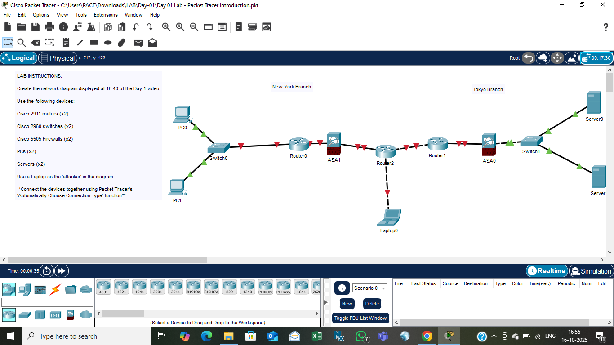

# Day 01 — Packet Tracer Introduction

**Date:** 2025-10-16  

---

## 🧠 Lab Overview
Created a network diagram using Packet Tracer as shown below.

### Devices used
- 2 × Cisco 2911 Routers  
- 2 × Cisco 2960 Switches  
- 2 × Cisco 5505 Firewalls (ASA)  
- 2 × PCs  
- 2 × Servers  
- 1 × Laptop (used as “attacker”)

Connections made using **Auto Choose Connection Type**.

---

## 🖼️ Topology Screenshot

---

## 📂 Files
- `Day 01 Lab - Packet Tracer Introduction.pkt`
- `Screenshot.png`

---

## 🔍 Learnings
- Built a basic multi-site network (New York ↔ Tokyo).  
- Learned to connect routers, switches, and firewalls.  
- Understood physical vs logical views in Packet Tracer.

