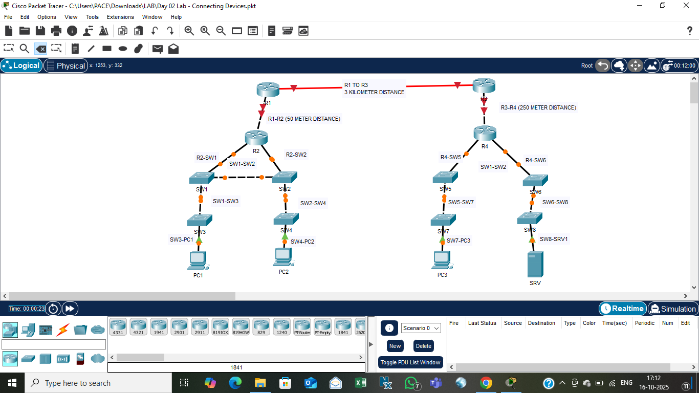

# Day 02 — VLAN Configuration and Basic Routing

**Date:** 2025-10-17  
**Author:** Balaji — NMS Engineer, Pace Digitek Ltd  

---

## 🎯 Lab Overview
Today’s focus: create VLANs on switches and establish basic inter-VLAN routing between departments.

### Devices used
- 2 × Cisco 2960 Switches  
- 1 × Cisco 2911 Router  
- 2 × PCs (different VLANs)

---

## 🧩 Steps
1. Create VLAN 10 (Sales) and VLAN 20 (Engineering).  
2. Assign access ports to each VLAN.  
3. Configure trunk between switches.  
4. Enable router-on-a-stick on Router0 for inter-VLAN communication.  
5. Test connectivity using ping between VLANs.

---

## 🖼️ Topology Screenshot

---

## 📂 Files
- `Day 02 Lab – VLAN Routing.pkt`  
- `Screenshot.png`

---

## 💡 Learnings
- Understood VLAN segmentation and trunk ports.  
- Learned inter-VLAN routing configuration.  

